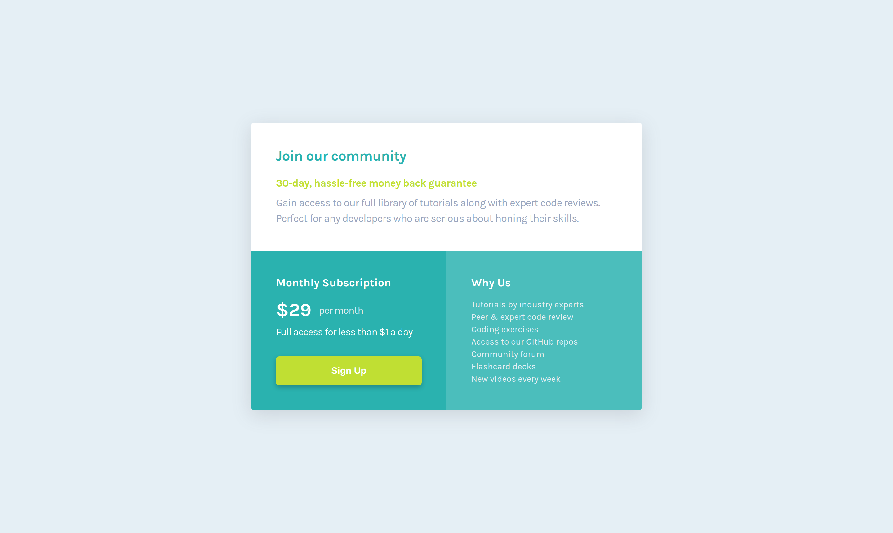

# Frontend Mentor - Single price grid component solution

This is a solution to the [Single price grid component challenge on Frontend Mentor](https://www.frontendmentor.io/challenges/single-price-grid-component-5ce41129d0ff452fec5abbbc). Frontend Mentor challenges help you improve your coding skills by building realistic projects.

## Table of contents

- [Overview](#overview)
  - [The challenge](#the-challenge)
  - [Screenshots](#screenshots)
  - [Link](#link)
- [My process](#my-process)
  - [Built with](#built-with)
  - [Biggest challenges](#biggest-challenges)
  - [Continued development](#continued-development)
  - [Useful resources](#useful-resources)
- [Author](#author)

## Overview

### The challenge

Users should be able to:

- View the optimal layout for the component depending on their device's screen size
- See a hover state on desktop for the Sign Up call-to-action

### Screenshots

 

### Link

- [Solution URL](https://aguscorvo.github.io/single-price-grid-component/)

## My process

### Built with

- Semantic HTML5 markup
- CSS custom properties
- Flexbox
- CSS Grid
- Mobile-first workflow

### Continued development

My next project will be [Huddle landing page with a single introductory section](https://www.frontendmentor.io/challenges/huddle-landing-page-with-a-single-introductory-section-B_2Wvxgi0). Then I'll focus on challenges that includes Javascript.

### Useful resources

- [Platzi](https://platzi.com)
- [freeCodeCamp](https://www.freecodecamp.org)
- [MDN Web Docs](https://developer.mozilla.org/en-US/docs/Web/CSS)

## Author

- Frontend Mentor - [@aguscorvo](https://www.frontendmentor.io/profile/aguscorvo)
- Twitter - [@agustina_corvo](https://twitter.com/agustina_corvo)
